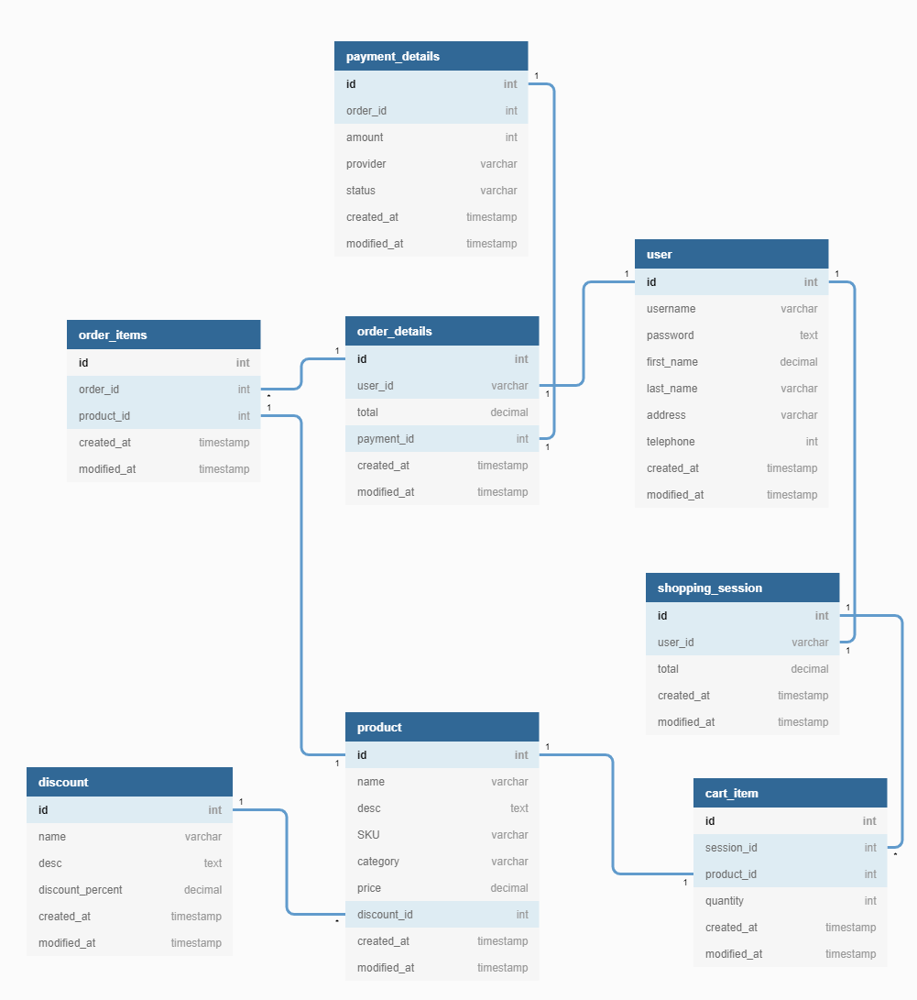

# droffiliate


<h4>
This Project is about the final project at General Assembly 12-12.The project is about the drop shipping where online seller does not require to have an  inventory ( which I failed while trying with shopify 2 yrs ago). And Also My  desire owning a affiliate  website 15 yrs ago which I learnt to built through google blog  and  tried to monetize through  google adsense while working at an Interne Service Provider Company.
</h4>
<hr>

<h5> <strong>Belo are the Technologies used/ will be using to build this website.</strong>

</h5>
Front End

```
HTML
CSS
JavaScript
Reactjs
Materalize.css
```
Backend and Database

```
Python
Django
Nodejs
Postgresql
Authentication and Authorization

```
<hr>

User Stories:- <br>
As a user I want the following features on

```
-the ability to create account
-sign in and sign up 
-browse products
-add products to my wishlist 
-add products ot the  Cart 
-rate the products
* Review products
*make a payment  
```


.jpeg)

.jpeg)

.jpeg)

.jpeg)

